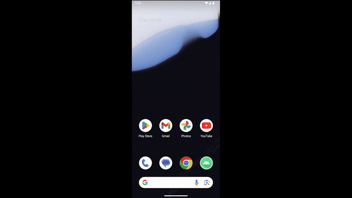

<!-- ABOUT THE PROJECT -->
## About The Project

Simple Sudoku Solver app that helps you solve Sudoku puzzles by taking a photo of the puzzle. It uses OpenCV to process the image, detect the grid, and clean up the numbers, while a Convolutional Neural Network (CNN) model extracts and recognizes the numbers in the grid. After that, the app solves the puzzle and shows you the completed solution. 

### Built With

* 
* 
* 
* 
